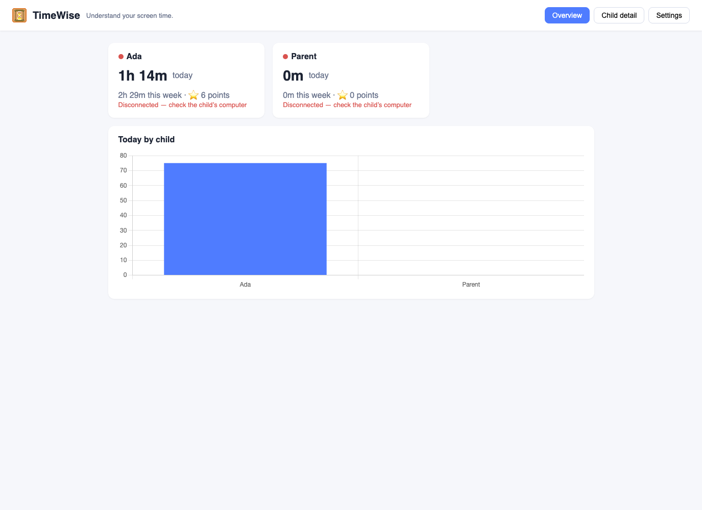
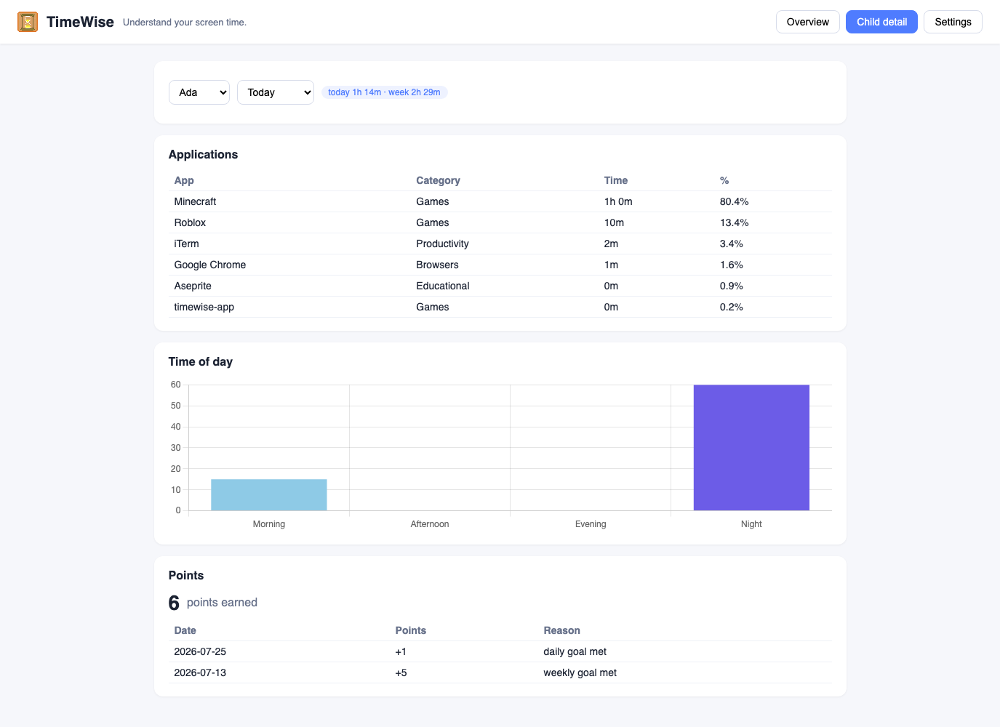
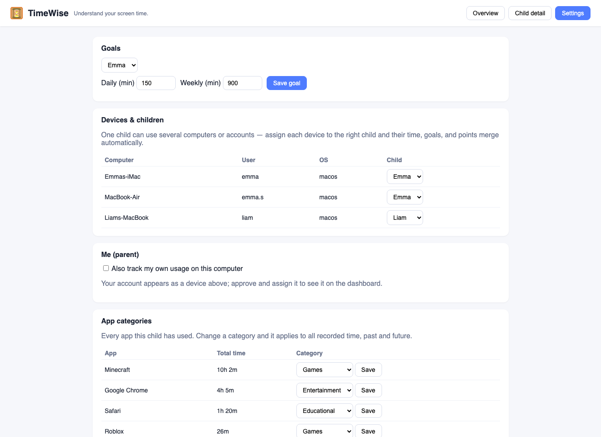

# TimeWise

> *Understand your screen time.*

TimeWise is a privacy-first screen time tracker for families. It helps kids (under 15) see how much time they spend on their computers — building self-awareness through data visibility and positive reinforcement, **not punishment or enforcement**. All data stays inside your home network. No cloud, no accounts, no subscriptions.



## How it works

One app, two roles — chosen per OS user account on first launch:

| Role | Runs on | Does |
|---|---|---|
| **Master** | A parent's computer (one per parent, multiple allowed) | Embedded server + database + parent dashboard. Receives data from workers on the home network |
| **Worker** | Each child's computer/account | Tracks the active window, buffers locally, syncs to master(s) every 60 s, shows gentle nudges |

```
Child's Mac/PC                    Parent's Mac
┌────────────────────┐            ┌─────────────────────────┐
│ Window tracker (2s)│            │ REST API (LAN :47820)   │
│ Idle pause (5 min) │   HTTP/    │ SQLite                  │
│ Local buffer       │── JSON ──▶ │ Dashboard (in-app)      │
│ Sync + heartbeat   │   LAN      │ Goals / points / merge  │
└────────────────────┘            └─────────────────────────┘
        mDNS auto-discovery · zero cloud · works offline
```

## Features

- **Passive tracking** — app + window title, session-based, categorized automatically (Games, Educational, Entertainment, Social Media, Productivity, Browsers, Other) with parent overrides
- **Parent dashboard** — per-child totals (day/week), per-app breakdown, time-of-day distribution, live online/offline status, points
- **Child status screen** — kids see their own day, goal progress, and points
- **Goals & points** — daily/weekly goals per child; points awarded only for completed days/weeks with actual usage
- **Gentle nudges** — positively-framed, non-blocking notifications at 90/100/110% of goal, plus stretch-break prompts after 40 min of continuous use
- **Multi-device identity merge** — one child, several computers or usernames: merge devices into one child and time/goals/points combine
- **Multiple parents** — workers can report to more than one master
- **Home-network only** — mDNS auto-discovery, offline buffering with exponential-backoff resync, no data ever leaves the LAN
- **Lightweight** — Rust/Tauri 2, near-zero idle CPU, system-tray app, starts at login
- **Parent self-tracking** — optional, because awareness is for everyone

## Screenshots

| Child detail | Settings: goals, device merge, categories |
|---|---|
|  |  |

## Install

### macOS

Download `TimeWise.app` from [Releases](https://github.com/CooperWaNg-py/TimeWise/releases) (or build from source below), move it to `/Applications`, and open it.

1. On a **parent's** computer: choose **Parent (Master)** on first launch.
2. On each **child's** computer (under their own OS account): choose **Child (Worker)**, then **Search the network** and pair with the parent — or enter the parent's address manually.
3. Back on the parent's dashboard: **approve** the new device and assign it to a named child.
4. macOS may ask for Accessibility permission (needed to read window titles) and notification permission — grant both on worker machines.

### Windows

Build from source (below) or grab the CI-built installer from Actions/Releases. Windows support compiles clean; runtime testing is in progress.

## Build from source

Prerequisites: [Rust](https://rustup.rs) (stable), macOS: Xcode CLT · Windows: VS Build Tools + WebView2.

```bash
git clone https://github.com/CooperWaNg-py/TimeWise.git
cd TimeWise
cargo test --workspace          # 57 tests
cargo build -p timewise-app     # debug binary at target/debug/timewise-app

# macOS .app bundle (output: target/release/bundle/macos/TimeWise.app)
cd crates/timewise-app && npx @tauri-apps/cli@2 build --bundles app
```

Run two roles on one machine for testing with separate data dirs:

```bash
TIMEWISE_HOME=/tmp/tw-master ./target/debug/timewise-app   # pick Master
TIMEWISE_HOME=/tmp/tw-worker ./target/debug/timewise-app   # pick Worker
```

## Tech

Rust · Tauri 2 · axum · rusqlite (SQLite) · reqwest · mdns-sd · Chart.js (vendored, no CDN). Workspace: `crates/timewise-core` (models, categorizer, stores) + `crates/timewise-app` (worker runtime, master server, Tauri shell, dashboard UI). CI builds and tests on macOS and Windows.

## Design principles

- **Awareness, not enforcement** — no lockouts, no blocking; data sparks family conversation
- **Positive reinforcement** — points and encouragement over punishment
- **Privacy by default** — everything stays on your home network
- **Simplicity** — a child who can't use it won't use it

## Status

Working MVP in active home use (macOS). Windows cross-compiles and passes CI; runtime validation ongoing. Roadmap: mobile tracking, browser-extension URL classification, printable weekly report card. See `product_requirement.md` for the full PRD.

## License

MIT
